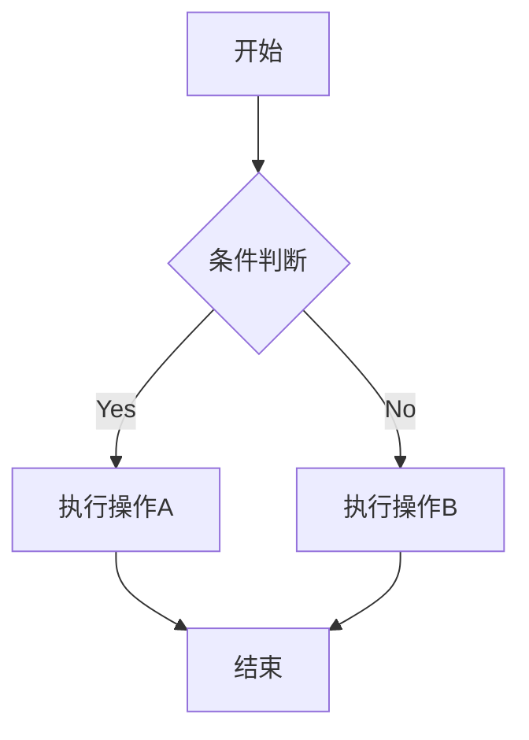
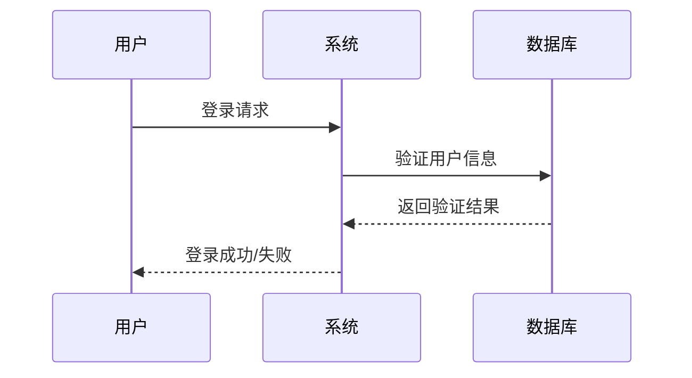
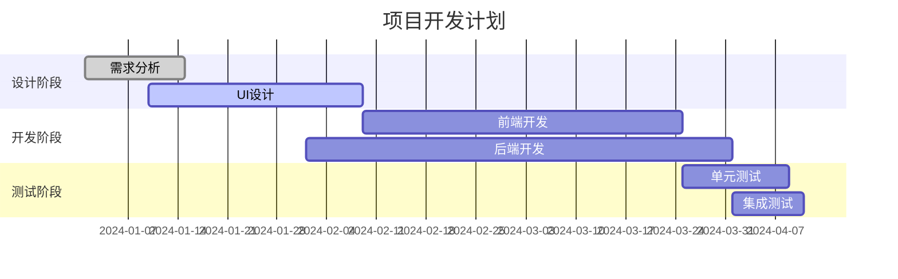
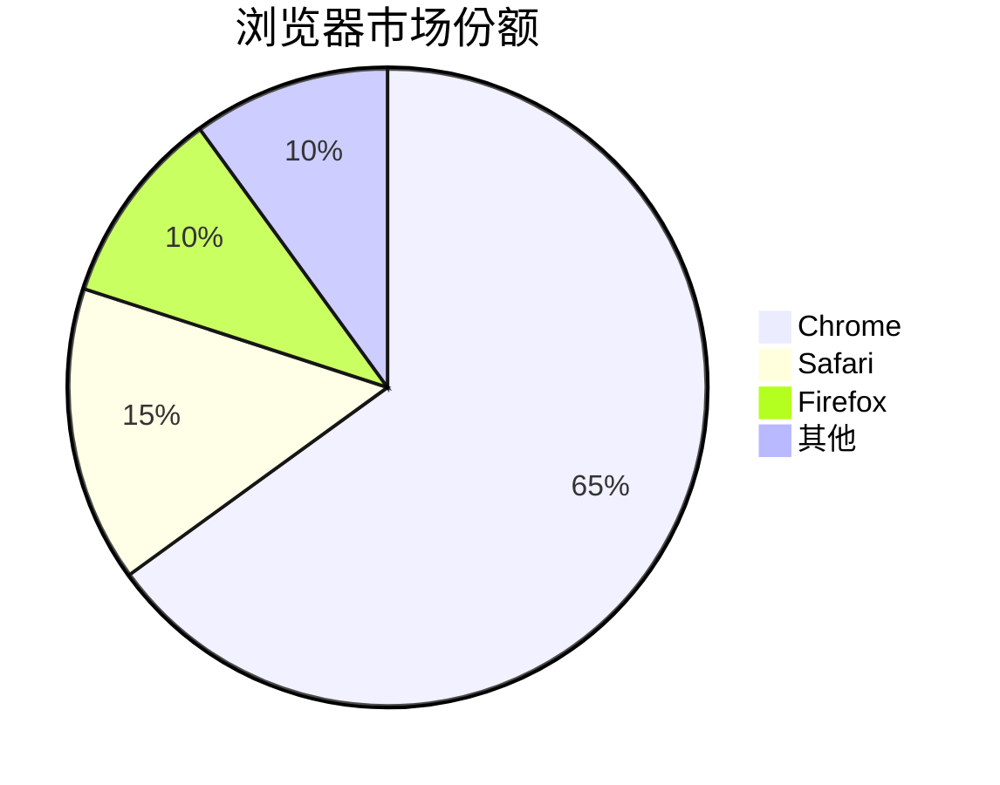
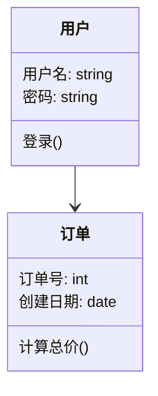

#Markdown
#### 常见的 Markdown 图表工具

**Mermaid**

Mermaid 是最流行的 Markdown 图表工具之一，它允许你使用简单的文本语法生成各种图表。

**支持图表类型**

- 流程图 (Flowchart)
- 序列图 (Sequence Diagram)
- 类图 (Class Diagram)
- 状态图 (State Diagram)
- 甘特图 (Gantt Chart)
- 饼图 (Pie Chart)

#### 流程图

**流程图方向**

- `TB`：从上到下
- `BT`：从下到上
- `RL`：从右到左
- `LR`：从左到右

**节点形状**

- `A[方形]`：矩形
- `B(圆角矩形)`：圆角矩形
- `C{菱形}`：菱形（决策）
- `D((圆形))`：圆形
- `E>旗帜形]`：旗帜形

**连接线类型**

- `-->` 实线箭头
- `-.->` 虚线箭头
- `==>` 粗实线箭头
- `---` 实线
- `-.-` 虚线

#### 时序图和甘特图

##### 时序图

**时序图语法要点**

- `participant` 定义参与者
- `->>` 实线箭头
- `-->>` 虚线箭头
- `note` 添加注释

##### 甘特图

**通用结构**

`任务名称: 状态, 任务ID, 开始时间, 结束时间`

**甘特图语法要点**

- `title` 设置标题
- `dateFormat` 定义日期格式
- `section` 定义阶段
- 任务状态：`done`（已完成）、`active`（进行中）、`crit`（关键）

#### 饼图

#### 图表类型

1. 流程图（graph）
2. 时序图（sequenceDiagram）
3. 甘特图（gantt）
4. 饼图（pie）
5. 类图（classDiagram）

#### 参考官方文档

- [Mermaid 官方文档](https://mermaid.js.org/)